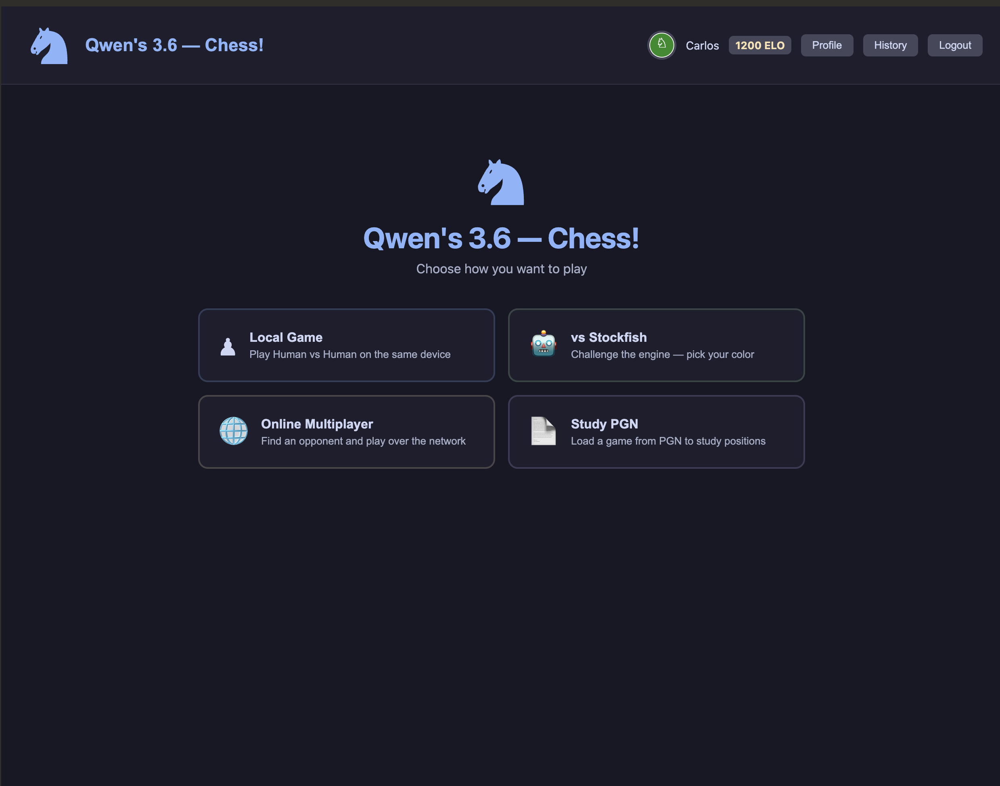
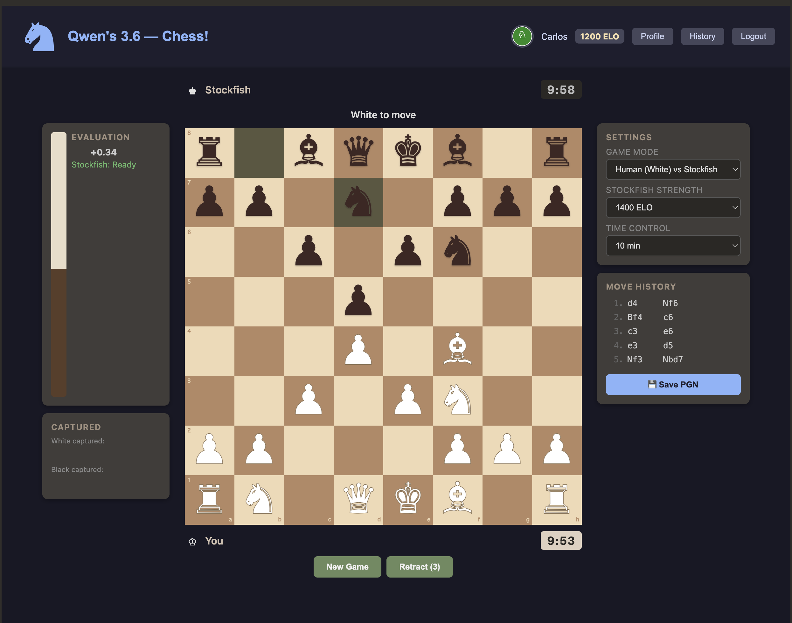
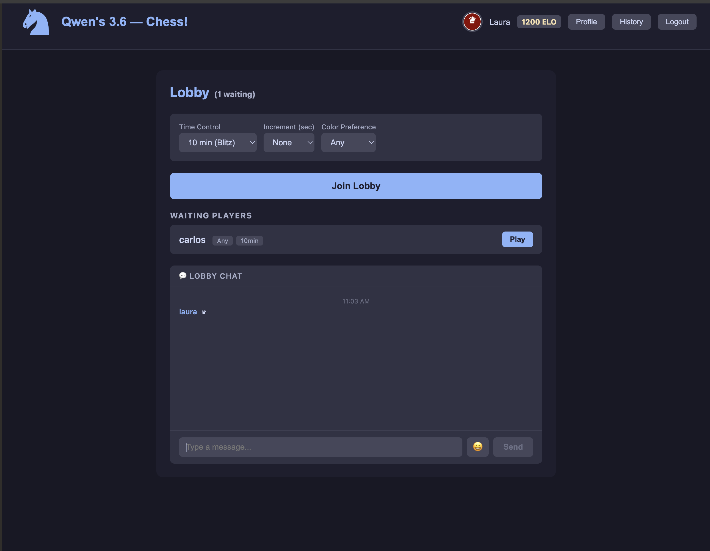
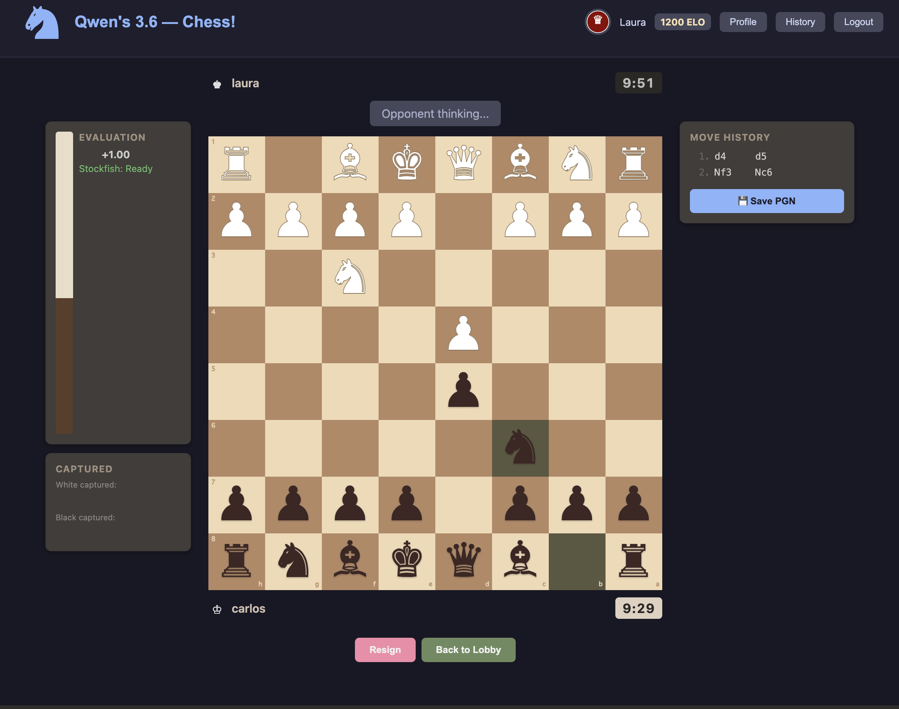
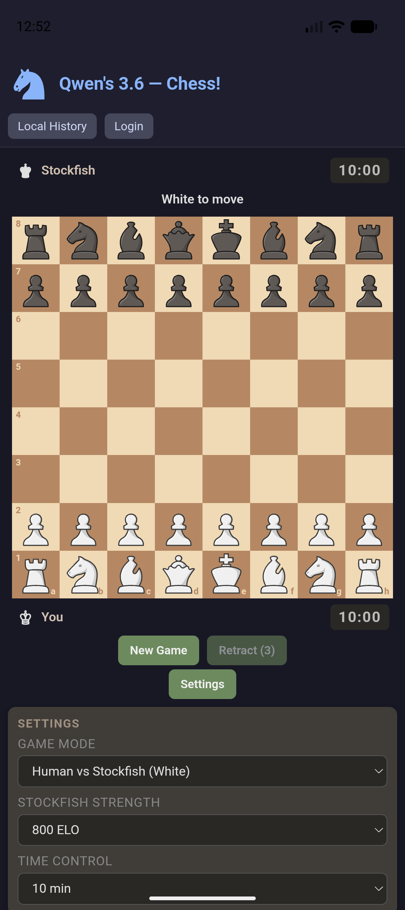
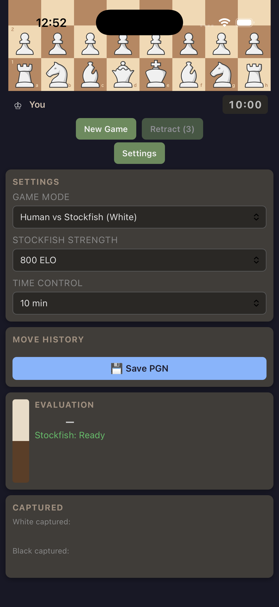
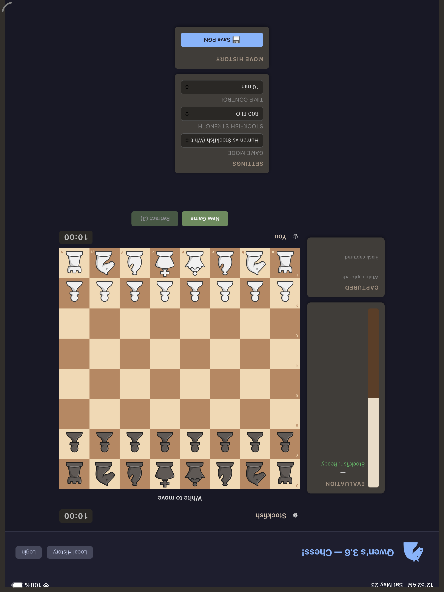

# Qwen's 3.6 — Chess!

A full-featured chess application with online multiplayer, Stockfish engine integration, rated game history, and user accounts.

## Screenshots

### Home — Choose Your Game Mode



### vs Stockfish



### Lobby with Chat



### Online Multiplayer



## Architecture

```
┌─────────────────────────────────────────────────────────────────────┐
│  Browser (User A)         Browser (User B)                          │
│  ┌──────────────────┐     ┌──────────────────┐                      │
│  │ React Frontend   │     │ React Frontend   │                      │
│  │ (Vite dev /      │     │ (Vite dev /      │                      │
│  │  nginx prod)     │     │  nginx prod)     │                      │
│  └──────┬───────────┘     └──────┬───────────┘                      │
│         │ WebSocket (ws)         │ WebSocket (ws)                   │
│         └──────────┬─────────────┘                                  │
│                    ▼                                                │
│  ┌───────────────────────────────────────┐                          │
│  │  Backend API + WebSocket Server Pods  │                          │
│  │  (Node.js + Express + ws)             │                          │
│  │  - REST: auth, profiles, history      │                          │
│  │  - WS:  moves, lobby, heartbeats      │                          │
│  └───────────────┬──────────────┬────────┘                          │
│                  │              │                                   │
│  ┌───────────────▼────────┐  ┌──▼─────────────────┐                 │
│  │ Redis 7                │  │ PostgreSQL 18      │                 │
│  │ - lobby presence       │  │ - users, sessions  │                 │
│  │ - pod routing/pubsub   │  │ - games, moves     │                 │
│  │ - room coordination    │  │ - game_history     │                 │
│  │ - lobby chat pub/sub   │  │                    │                 │
│  └────────────────────────┘  └────────────────────┘                 │
│                                                                     │
│  Durable game records remain in PostgreSQL; realtime fanout and     │
│  ephemeral online state are coordinated through Redis.              │
└─────────────────────────────────────────────────────────────────────┘
```

## Architecture Components

### Frontend Runtime

- **SPA shell**: `chess-app/src/App.tsx` owns authenticated routing, top navigation, and the shared `GameWebSocketProvider`.
- **Auth state**: `chess-app/src/context/AuthContext.tsx` loads the stored JWT user, refreshes `/api/users/me`, and exposes profile updates to the UI.
- **API client**: `chess-app/src/lib/api.ts` wraps REST calls, attaches access tokens, refreshes expired tokens, records Stockfish games, and fetches Elo/history data.
- **WebSocket client**: `chess-app/src/context/GameWebSocketContext.tsx` maintains the online game session, lobby state, lobby chat messages, draw offers, move sync, and game-over events.
- **Local engine hook**: `chess-app/src/hooks/useChessGame.ts` is the source of truth for local board behavior, Stockfish turns, legal move guards, SAN generation, clocks, sounds, and local Stockfish result recording.
- **Stockfish worker**: `chess-app/public/stockfish.js` contains Stockfish 18.0.7 as a single browser worker file with the WASM payload embedded, so production deployments only need to serve `/stockfish.js`.
- **Board UI**: `Board.tsx` and `Square.tsx` render selected squares, legal targets, last move, check/checkmate clues, flipped orientation, coordinates, and text-rendered chess symbols for mobile compatibility.
- **Study mode**: `PGNLoader.tsx` and `engine/pgn.ts` parse PGN, replay moves through legal source-square resolution, and expose move-by-move navigation.
- **History/profile**: `GameHistory.tsx` shows the last 50 rated games and last-10 Stockfish performance; `Profile.tsx` shows the current Elo summary.

### Browser And Database Boundary

- The browser never connects to the database directly and does not contain database credentials, connection strings, SQL, or database client libraries.
- Frontend data access goes through the same-origin HTTP API under `/api/...` and realtime game traffic goes through `/ws`.
- The backend is the only runtime that knows which database is used. It owns `DATABASE_URL`, validates requests, executes database queries, and returns API/WebSocket responses to the browser.
- This keeps the browser independent of the storage implementation: the frontend does not know or care whether the backend uses PostgreSQL or a different database behind the API.

### Backend Runtime

- **HTTP server**: `backend/src/server.ts` wires Express middleware, REST routes, health checks, and the WebSocket server onto the same HTTP server.
- **Auth routes/services**: `routes/auth.ts`, `routes/user.ts`, and `services/userService.ts` handle registration, login, JWT refresh/logout, profile reads, and profile updates.
- **Game history service**: `services/gameHistoryService.ts` records rated Stockfish and multiplayer results, updates user Elo totals, and returns last-50 history plus aggregate stats.
- **Elo engine**: `engine/elo.ts` implements expected score, K-factor, rating deltas, rating caps, and performance rating from recent rated games.
- **Server chess engine**: `engine/logic.ts` and `engine/notation.ts` validate online moves and generate FEN/SAN from legal board state.
- **Redis coordination**: `ws/server.ts` stores lobby presence and player-to-room ownership in Redis, and uses Redis pub/sub to route WebSocket messages between backend pods.
- **Game rooms**: `ws/rooms.ts` owns live game state, clocks, legal move enforcement, draw/resign/checkmate/stalemate handling, SAN move persistence, game-over broadcasts, and multiplayer history recording on the backend pod that owns the game.
- **WebSocket server**: `ws/server.ts` authenticates socket clients, routes lobby/game messages across pods, reconnects players, and sends heartbeats.

### Data Model

- **`users`**: credentials, display profile, avatar, Elo rating, and aggregate win/loss/draw counters.
- **`user_sessions`**: hashed refresh tokens and expiration dates.
- **`games`**: multiplayer and Stockfish game records, player ids, status, result, clocks, and finish time.
- **`moves`**: online move records with move number, UCI, SAN, and side to move.
- **`game_history`**: per-user rated results with opponent, opponent Elo, player color, Elo before/after, Elo delta, performance Elo, move count, and duration.

### Deployment Topology

- **Docker Compose** runs `postgres`, `redis`, `backend`, and `chess`; each frontend Nginx container is stateless and proxies `/api` and `/ws` to the backend service.
- **OpenShift** uses Docker build objects under `k8s/openshift/`, deployments under `k8s/03-backend.yml` and `k8s/04-frontend.yml`, persistent StatefulSets for Postgres and Redis, and an edge-terminated frontend Route.
- **Replica policy** runs multiple frontend pods and multiple backend pods. Backend pods coordinate lobby state, player room ownership, and cross-pod WebSocket fanout through Redis while durable records stay in PostgreSQL.

## Runtime Flows

- **Stockfish game result**: local hook detects a completed Stockfish game, determines human result and Stockfish Elo, posts `/api/users/me/history/stockfish`, then refreshes the user profile so the top bar and profile Elo update.
- **Stockfish retract**: human players can retract their latest move against Stockfish up to 3 times per game. Any Stockfish game where a retract is used is treated as unrated and is not posted to ELO history.
- **Stockfish strength control**: the UI exposes 500-2400 strength levels in 100-point increments. Stockfish 18 only advertises native `UCI_Elo` support from 1320 upward, so levels below 1320 are intentionally weakened in the app with shallow searches, MultiPV candidate selection, and a tapered chance to choose any legal move. The random legal move chance starts at 45% for 500 Elo and drops to 8% by 1300 Elo, while 1400+ uses native strength without random moves.
- **Multiplayer move**: client sends UCI over WebSocket, backend validates the source piece and legal move, applies the move on cloned server state, persists SAN, broadcasts state, and rejects illegal moves.
- **Multiplayer game finish**: room end states update `games`, record a rated `game_history` row for each player, broadcast `game_over`, and leave the final state available to clients.
- **PGN replay**: the PGN loader strips headers/comments/NAGs, resolves each SAN move against legal moves from replay state, applies the move, and keeps FEN-related context such as castling and en passant current.
- **Responsive board rendering**: CSS breakpoints keep desktop sidebars, collapse tablet panels under the board, and use a full-width phone board with text chess symbols to avoid mobile emoji pawn substitution.

## Tech Stack

| Layer | Technology |
|-------|-----------|
| **Frontend** | React 19, TypeScript, Vite 8, react-router-dom |
| **Backend** | Node.js 20, Express, TypeScript, `ws` (WebSocket) |
| **Database** | PostgreSQL 18 |
| **Realtime Coordination** | Redis 7 |
| **Chess Engine** | Stockfish.js 18.0.7 (client-side Web Worker, embedded WASM single file) |
| **Containerization** | Docker, Docker Compose, Nginx (frontend proxy) |
| **Auth** | JWT (access + refresh tokens), bcrypt |
| **Mobile Shells** | Capacitor 8 Android WebView / iOS WKWebView with bundled offline app assets |

## Game Modes

- **Single Player** — defaults to Human playing White vs Stockfish
- **vs Stockfish** — choose Human as White or Black vs Stockfish engine
- **Local Human vs Human** — available from the game-mode dropdown on the local board
- **Online Multiplayer** — Real-time Human vs Human with lobby, matchmaking, and move sync
- **PGN Study** — Load and replay games from PGN files

## Mobile Apps

The project includes Capacitor native shells under `chess-app/android/` and `chess-app/ios/`.

- Android phones/tablets run the app in Android System WebView, which is Chrome-backed on normal Android devices.
- iPhone/iPad runs the same app in WKWebView, because iOS does not allow third-party browser engines inside native apps.
- Both shells bundle the web app for offline play. Local Human-vs-Human, Human-vs-Stockfish, and PGN study work without reaching the home server.
- Server-backed features still use `https://chess-chess-project.apps.ocp-think.levelg.io` for login, profile/history sync, lobby, online games, and WebSockets.
- Devices must be on a network that can resolve and reach that route for online features. The route can stay private to your home network; the app does not make it public.
- In the native apps only, the last logged-in account remains available for offline local play when the server is unreachable. Browser sessions continue to validate against the server.
- The login and register screens include a Continue offline path back to the local app shell.
- Completed local Stockfish games are saved on-device first and synced to rated server history when the account is logged in and the server is reachable.

Mobile screenshots:

<p>
  
  
  
</p>

Mobile workflow:

```bash
cd chess-app
npm run cap:sync
npm run cap:open:android
npm run cap:open:ios
```

Testing/build notes:

- Android Studio is required for emulator/device testing. The debug APK builds with Android Studio's bundled JBR:

  ```bash
  cd chess-app/android
  JAVA_HOME="$HOME/Applications/Android Studio.app/Contents/jbr/Contents/Home" ./gradlew :app:assembleDebug
  ```

- The debug APK is written to `chess-app/android/app/build/outputs/apk/debug/app-debug.apk`.
- A connected Android device with USB debugging can install the same debug APK:

  ```bash
  adb install -r chess-app/android/app/build/outputs/apk/debug/app-debug.apk
  ```

- Create at least one phone/tablet AVD in Android Studio Device Manager before running emulator tests. `emulator -list-avds` should print the AVD name.
- Xcode is required for iPhone/iPad builds. Install an iOS simulator runtime in Xcode Settings > Platforms before simulator builds; without a runtime, `xcodebuild` reports no destinations. Real iPhone/iPad installation requires opening `chess-app/ios/App/App.xcodeproj`, selecting a signing team for bundle id `io.levelg.chess`, then running the `App` scheme on the connected device.

## User Features

- **Account System** — Registration, login, JWT authentication, profile management
- **Avatar Selection** — 12 chess-themed avatars (6 pieces × 2 styles)
- **ELO Rating** — Automatic ELO calculation after Stockfish and multiplayer games (K-factor: 32 for new players, 24 for established, 16 for 2000+)
- **Game History** — Last 50 rated games, rating deltas, opponent rating, color, moves, and duration
- **Stockfish Performance** — Last 10 Stockfish games contribute a performance rating using Stockfish's selected ELO
- **Profile Page** — View and edit display name, avatar, and ELO stats
- **Lobby Chat** — Realtime text chat with emoji picker for users waiting in the lobby; messages auto-expire after 10 minutes, delivered across pods via Redis pub/sub
- **Responsive Layouts** — Desktop, tablet, and phone layouts for the board, clocks, panels, and history views

## Project Structure

```
chess-project/
├── chess-app/                 # React frontend
│   ├── src/
│   │   ├── components/        # React components
│   │   │   ├── Board.tsx      # Chess board with square interaction
│   │   │   ├── Clock.tsx      # Chess clock display
│   │   │   ├── GameHistory.tsx # Last 50 games and Stockfish performance
│   │   │   ├── Lobby.tsx      # Online lobby with matchmaking and realtime chat (emoji picker, 10-min expiry)
│   │   │   ├── LocalGame.tsx  # Local/Stockfish game view
│   │   │   ├── OnlineGame.tsx # Online multiplayer game view
│   │   │   ├── PGNLoader.tsx  # PGN file/game loader
│   │   │   ├── Profile.tsx    # User profile with ELO stats
│   │   │   ├── Settings.tsx   # Game settings
│   │   │   └── ...
│   │   ├── context/           # React contexts (Auth, WebSocket)
│   │   ├── engine/            # Chess logic (types, logic, notation, PGN)
│   │   ├── hooks/             # Custom hooks (useChessGame)
│   │   ├── lib/               # API client, WebSocket client, auth utils
│   │   └── App.tsx            # Main app with routing
│   ├── public/
│   │   ├── avatars/           # Chess piece SVG avatars
│   │   └── stockfish.js       # Stockfish engine (Web Worker)
│   └── Dockerfile             # Multi-stage build (node → nginx)
│
├── backend/                   # Node.js backend
│   ├── src/
│   │   ├── db/                # PostgreSQL connection, migrations
│   │   ├── engine/            # Server-side chess logic (move validation)
│   │   ├── middleware/        # Auth, validation
│   │   ├── routes/            # REST API routes (auth, users)
│   │   ├── services/          # Business logic (users, game history, ELO)
│   │   ├── ws/                # WebSocket server (lobby, rooms, heartbeats)
│   │   └── server.ts          # Express app + WebSocket attachment
│   └── Dockerfile             # Multi-stage build (node → node)
│
├── docker-compose.yml         # Orchestration (postgres, redis, backend, chess)
└── k8s/                       # Kubernetes/OpenShift manifests and build configs
```

## Docker Services

| Service | Image | Port | Description |
|---------|-------|------|-------------|
| `chess` | nginx:alpine | 3001:80 | Frontend SPA + API/WS proxy (BACKEND_HOST env) |
| `backend` | node:20-alpine | 3000 | REST API + WebSocket server |
| `postgres` | postgres:18-alpine | 5432 | PostgreSQL database |
| `redis` | redis:7-alpine | 6379 | Realtime lobby and WebSocket coordination |

## OpenShift Deployment

All Kubernetes manifests live in `k8s/`. They target OpenShift with the `px-csi-db` StorageClass for Postgres persistence.

### Prerequisites

- `oc` CLI logged into your OpenShift cluster
- Portworx CSI driver installed (`px-csi-db` StorageClass available)
- Docker images built and pushed to your OpenShift image registry (or accessible)

### One-command deploy

```bash
oc apply -f k8s/00-namespace.yml
oc apply -f k8s/01-secret.yml
oc apply -f k8s/02-postgres.yml
oc apply -f k8s/06-redis.yml
oc apply -f k8s/03-backend.yml
oc apply -f k8s/04-frontend.yml
```

### Post-deploy steps

```bash
# Grant anyuid SCC to the default service account so Postgres can run as non-root
oc adm policy add-scc-to-user anyuid -z default -n chess-project

# Wait for Postgres to be ready (it needs time to initialize)
oc wait --for=condition=ready pod -l app=postgres -n chess-project --timeout=120s

# Apply the database schema
oc exec -n chess-project statefulset/postgres -- sh -c "psql -U chess -d chess -f /app/init-db.sql" \
  < backend/init-db.sql

# (or copy the file into the pod first)
oc cp backend/init-db.sql chess-project/postgres-0:/tmp/init-db.sql
oc exec -n chess-project pod/postgres-0 -- psql -U chess -d chess -f /tmp/init-db.sql
```

### Update secrets before production

Edit `k8s/01-secret.yml` and replace the placeholder values:

- `jwt-secret` / `jwt-refresh-secret` — generate strong random strings
- `cors-origin` — set to your OpenShift frontend route (e.g. `https://chess-chess-project.apps.cluster.example.com`)

### Access the app

After deploying, the OpenShift Route exposes the frontend:

```bash
oc get route chess -n chess-project -o jsonpath='{.spec.host}'
```

### Image management

Build and push images to your OpenShift registry:

```bash
# Login to OpenShift registry
oc registry login

# Build with oc new-build or docker
docker build -t <registry>/<project>/chess-project-backend:latest ./backend
docker build -t <registry>/<project>/chess-project-chess:latest ./chess-app

docker push <registry>/<project>/chess-project-backend:latest
docker push <registry>/<project>/chess-project-chess:latest

# The frontend container uses BACKEND_HOST env var to find the backend.
# In OCP it defaults to "backend.chess-project.svc.cluster.local" (set in k8s/04-frontend.yml).
# For local docker-compose it defaults to "backend".

# Then update image references in k8s/03-backend.yml and k8s/04-frontend.yml
# and re-apply:
oc apply -f k8s/03-backend.yml -f k8s/04-frontend.yml -n chess-project
```

### Manifest overview

| File | Resources |
|------|-----------|
| `00-namespace.yml` | Namespace `chess-project` |
| `01-secret.yml` | Secret with DB creds, JWT secrets, CORS origin |
| `02-postgres.yml` | PVC (5Gi, `px-csi-db`), headless Service, StatefulSet |
| `06-redis.yml` | PVC (1Gi, `px-csi-db`), headless Service, StatefulSet for Redis append-only realtime coordination |
| `03-backend.yml` | Service (HTTP + WS ports) + Deployment (2 replicas, REDIS_URL env, spread constraints, PDB, HPA, `imagePullPolicy: Always`) |
| `04-frontend.yml` | Service + Deployment (2 stateless frontend replicas, BACKEND_HOST env, `imagePullPolicy: Always`) + OpenShift Route (TLS edge termination) |

## Quick Start

```bash
# Start all services
docker compose up --build

# Access the app
open http://localhost:3001
```

## Backend Engine And Lobby Tests

The backend engine tests cover the assumptions used by online multiplayer move validation:

- legal white and black kingside castling from real opening sequences;
- rejecting castling when the king would cross an attacked square;
- clearing castling rights when a rook is captured on its starting square.

Run the backend engine tests locally:

```bash
cd backend
npx tsx --test tests/engine-castling.test.ts
```

Run all backend TypeScript compile checks:

```bash
cd backend
npm run build
```

### Lobby Integration Test

The backend has a formal WebSocket integration test for the scaled lobby path:

- two authenticated WebSocket clients connect through configurable endpoints;
- one client creates a lobby game and the other observes it through lobby state;
- the second client joins the game;
- a move is sent and verified on both clients, including opponent-only fanout.

Run it against Docker Compose after starting Redis and at least two backend replicas:

```bash
docker compose up --build -d --scale backend=2
cd backend
npm run test:integration
```

By default the test connects both clients through the frontend proxy at `ws://localhost:3001/ws`, which exercises the public Compose route. To target explicit endpoints, set `WS_URL_A` and `WS_URL_B`:

```bash
WS_URL_A=ws://localhost:3001/ws WS_URL_B=ws://localhost:3001/ws npm run test:integration
```

## Frontend Browser And Engine Tests

Browser tests cover offline route access, protected online route redirects, authenticated lobby rendering, the Online Multiplayer home card, deep-link/refresh behavior, chess rules, en passant, castling guards, legal castling from real game sequences, PGN parsing/replay assumptions, and the Stockfish 18 worker flow.

The focused engine/browser tests include:

- `tests/chess-rules.spec.ts`: legal move generation, en passant, castling guards, and white/black castling from real game sequences with FEN assertions.
- `tests/pgn-replay.spec.ts`: PGN headers, comments, NAGs, variations, legal SAN castling replay, and en passant replay.
- `tests/stockfish.spec.ts`: Stockfish 18 worker UCI readiness and bestmove behavior across a known line.
- `tests/offline-routes.spec.ts`: offline-capable routes, protected online routes, authenticated lobby rendering, and deep-link refresh behavior.

```bash
cd chess-app
npm run test:browser
```

To run the same route coverage against a built frontend, start Docker Compose and set `PLAYWRIGHT_BASE_URL`:

```bash
docker compose up -d --build
cd chess-app
PLAYWRIGHT_BASE_URL=http://localhost:3001 npm run test:browser -- tests/offline-routes.spec.ts
```

This production-route check catches regressions where the browser URL changes to `/lobby` but the SPA shell renders the Home page instead of the Lobby.

## Development

```bash
# Frontend (Vite dev server with HMR)
cd chess-app
npm run dev

# Backend (tsx watch for hot reload)
cd backend
npm run dev

# Database (PostgreSQL via Docker)
docker compose up postgres

# Realtime coordination (Redis via Docker)
docker compose up redis
```

## API Endpoints

### Authentication
- `POST /api/auth/register` — Create account
- `POST /api/auth/login` — Login, receive JWT tokens
- `POST /api/auth/refresh` — Refresh access token
- `POST /api/auth/logout` — Revoke refresh token

### User Profile
- `GET /api/users/me` — Current user profile (with ELO stats)
- `PATCH /api/users/me` — Update display name and/or avatar
- `GET /api/users/me/elo` — ELO statistics and performance rating
- `GET /api/users/me/history?limit=50` — Rated game history (last 50 games)
- `POST /api/users/me/history/stockfish` — Record a completed local Stockfish game
- `GET /api/users/:id` — Public profile

## WebSocket Protocol

| Direction | Type | Description |
|-----------|------|-------------|
| Client → Server | `auth` | Send JWT token on connect |
| Client → Server | `lobby_join` / `lobby_leave` | Enter/exit waiting lobby |
| Client → Server | `lobby_chat` | Send a chat message to all lobby users (supports emoji, max 500 chars) |
| Client → Server | `game_create` / `game_join` | Create/join a game |
| Client → Server | `move` | Send chess move (UCI format) |
| Client → Server | `resign` / `draw_offer` / `draw_accept` / `draw_decline` | Game actions |
| Server → Client | `lobby_state` | List of waiting players |
| Server → Client | `lobby_chat` | Chat message from a lobby user (includes sender, timestamp; auto-expired after 10 min) |
| Server → Client | `game_state` | Board state, clocks, turn |
| Server → Client | `opponent_move` | Other player's move |
| Server → Client | `game_over` | Game finished with result |
| Server → Client | `error` | Error message |

## ELO System

- **Starting Rating**: 1200
- **K-Factor**: 32 (first 30 games), 24 (established), 16 (2000+)
- **Performance Rating**: Calculated from the last 10 rated games, with Stockfish games using the selected Stockfish ELO
- **Auto-Tracking**: ELO updates automatically after Stockfish games and completed multiplayer games
- **Stats Tracked**: Wins, losses, draws, win rate, average performance rating

## Recent Gameplay Fixes

- Online board selection now follows the local board logic so selecting a piece does not shift or mutate pieces.
- Illegal online moves are rejected by the server and by the client-side legal move guard.
- Multiplayer check and checkmate clues match the local board.
- Multiplayer move, capture, check, checkmate, stalemate, promotion, and illegal-move audio matches local play.
- Multiplayer games require a draw offer, accepted draw, resignation, timeout, stalemate, or checkmate to finish.
- Draw offers notify the opponent with accept/reject actions.
- Boards flip for the player perspective when playing Black.
- Stockfish solo levels run from 500 ELO to 2400 ELO in 100-point increments.
- Stockfish 18 native `UCI_Elo` limiting is used from 1320 upward; lower UI levels use shallow searches, nearby MultiPV candidates, and tapered legal random moves from 45% at 500 Elo to 8% at 1300 Elo.
- PGN replay now resolves legal source squares correctly, including pawn moves such as `d4`.
- Local and multiplayer PGN move history uses legal SAN generation with captures, castling, promotion, checks, checkmate, and disambiguation.
- Mobile piece rendering uses text chess symbols so white and black pawns render correctly on mobile browsers.

## Database Schema

```sql
users              — id, username, email, password_hash, display_name, avatar, elo_rating, elo_games, elo_wins, elo_losses, elo_draws
user_sessions      — id, user_id, token_hash, expires_at
games              — id, white_player_id, black_player_id, status, fen, result, time_control, increment, created_at, finished_at
moves              — id, game_id, move_number, uci_move, san, played_by, created_at
game_history       — id, user_id, game_id, opponent, opponent_elo, player_color, result, player_elo_before/after, elo_change, performance_elo, move_count, game_duration_s
```

## License

Apache License 2.0. See [LICENSE](LICENSE).
